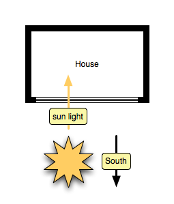
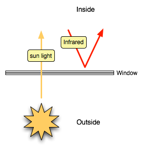

title: Rotating Houses
author: Rob
date: 2008-05-15

We here at drunkenpacket are concerned about energy efficiency. Really.
You might think that bouncing around the Internet would make us not
care but in our corporeal identity, there are *gasp* seasons.

Seasons are the bane of the architecture of energy-efficient houses: a
house needs to keep *in* every last erg of heat in the winter. But in the
summer, this would slowly bake the packet. (Perhaps poach or desiccate depending
on the humidity. Dry days would mummify the packet like dried fruit.
Dried fruit is yummy. Perhaps we should return to the original topic.)
In the summer, the house has an optional constraint: dissipate as much heat 
as possible to the outside.

The best way to heat a house is to let the sun warm the house. This implies
a winter architecture like the one shown here:

The house features thick opaque insulating layers on all sides except
the southern side. The southern side features windows by which sun
light can enter the house and warm its interior. These windows need to
be optically transparent at the wavelengths that the sun emits and
reflective to infrared energy leaving the interior as shown below.

Large expanses of windows with the above properties on the south side
of the house will maximize the ability of the house to collect and
retain heat from the sun.

In the summer, our goal is inverted: to minimize the amount that the
sun warms the house and to maximize the amount of energy that the
house radiates into the environment. The summer goal can be achieved
by building a different house: thick opaque walls on the south side
shade the house and all other sides of the house feature windows that
are reflective to infrared energy from the outside and transparent
(the packet likes seeing outside) in the optical wavelengths.

The packet has been thinking about these conflicting requirements.
There appears to be a solution: a rotating house with shutters. Here,
we simply rotate the house to adjust its interaction with the sun and
environment. (This idea is really just a green (and hence tax credit
inducing) justification for having a turret.  The packet has always wanted
a turret.)

Let me explain.  In the winter, we want to capture all of the sun
and have it go into warming the house.   Conversely, in the summer,
we want the house to have light but to block most of the sun's
intensity so as to avoid over-heating the house. These two
configurations are shown in the following diagram.  The house slowly
rotates over the course of the year from its summer to its winter
configuration.

In the winter night, we further supplement the night configuration
of the house with a thick insulating shutter (the solid black segment
sliding over the window.) In the summer, we remove (or perhaps open)
the windows to permit light and breezes to enter the house.  The
following diagram shows the rotating house.

The diagram also shows an optional extension: a second layer of
windows in the winter to help retain heat during the day.  As soon
as we've finished building the rotating platform large enough for
a five-story turret, we'll get around to calculating the benefit of
more layers of glass.

The packet so wants a turret. And if the house rotates, the view
would change.  That would be nice. It would help encourage staring
out the window instead of blogging.  And I could still wear my woven
bamboo hat.
